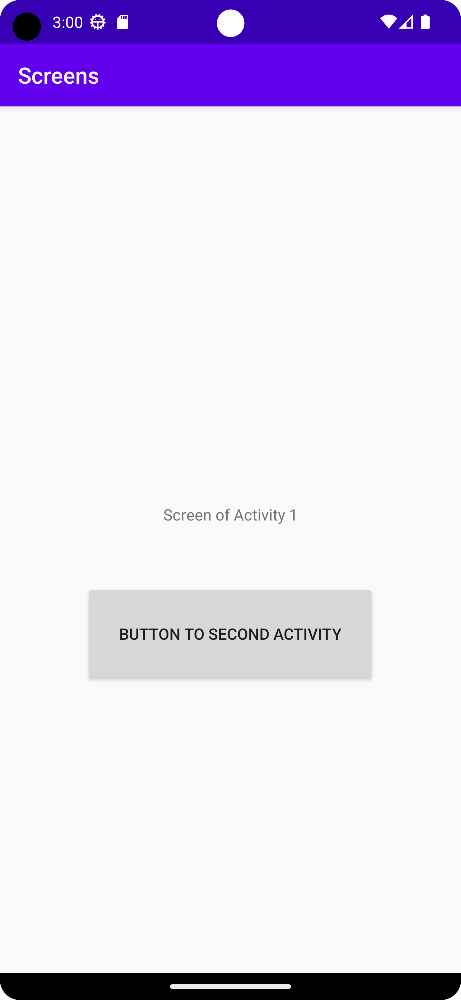
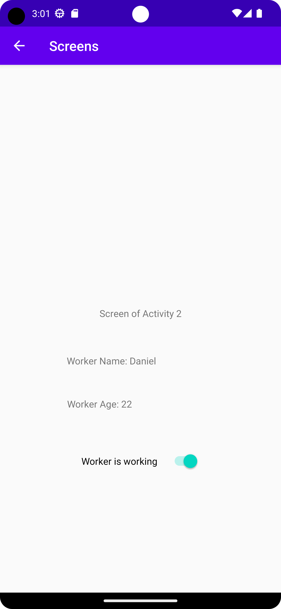

# Rapport

**Skriv din rapport här!**

Detta uppgift gick ut på att skapa en ny activity och föra över data till den. 

SecondActivity klass och xml var skapad. I xml fil var flera TextView tillagda samt ett switch för att illustrera 
de data som kommer att överföras från MainActivity. 

Vid start av programmet först kommer man fram till MainScreen eller MainActivity, för att komma vidare till SecondActivity
var en knapp implementerad i activity_main.xml. Knapp kommer inte fungera av sig själv den behöver en listner, och den
implementerades i Main klass. 

```
Button button = (Button) findViewById(R.id.buttonToSecondActivity);

        button.setOnClickListener(new View.OnClickListener() {
            @Override
            public void onClick(View view) {
                openSecondActivity();
            }
        });
```

När knappen aktiveras kommer en metod att köras openSecondActivity() i detta metod skapas det både bundel vilken
kommer att innehålla all data, samt en Intent för SecondActivity.
Bundel i detta fall kommer innehålla data om en arbetare, arbetare har ett namn, ålder och status.

```
        private void openSecondActivity() {

        //Bundle object is created
        Bundle extras = new Bundle();

        //Values to bundle
        extras.putString("WORKER_NAME","Daniel");
        extras.putInt("WORKER_AGE", 22);
        extras.putBoolean("WORKER_WORKING", true);

        //Intent is created and initialized
        Intent intent = new Intent(this, SecondActivity.class);

        //Bundle is attached to the Intent object
        intent.putExtras(extras);

        //Starting the activity
        startActivity(intent);
    }
```

Nu när data är skapad i Main klass ska den också vara tillgänglig i SecondActivity klassen.
Kod under visar hur data from Main kommer fram till SecondActivity.

När data är framställt används det setText metod för att ändra text på skärmen och på sådan sätt
kommer användare att se data på skärmen.

```
         //Getting the intent
        Intent intent = getIntent();

        //Getting values form the attached bundle
        Bundle extras = intent.getExtras();

        //Extracting the stored data
        String worker_name = extras.getString("WORKER_NAME");
        Integer worker_age = extras.getInt("WORKER_AGE");
        Boolean worker_working = extras.getBoolean("WORKER_WORKING");

        TextView textViewTop = (TextView) findViewById(R.id.textViewTop);
        TextView textViewMid = (TextView) findViewById(R.id.textViewMid);
        Switch switch1 = (Switch) findViewById(R.id.switch1);

        textViewTop.setText("Worker Name: " + worker_name);
        textViewMid.setText("Worker Age: " + worker_age); // ("" + ...) for numbers
        switch1.setChecked(worker_working);
```


Skärmdumpar:



